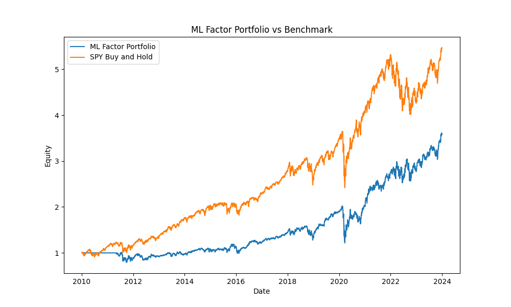
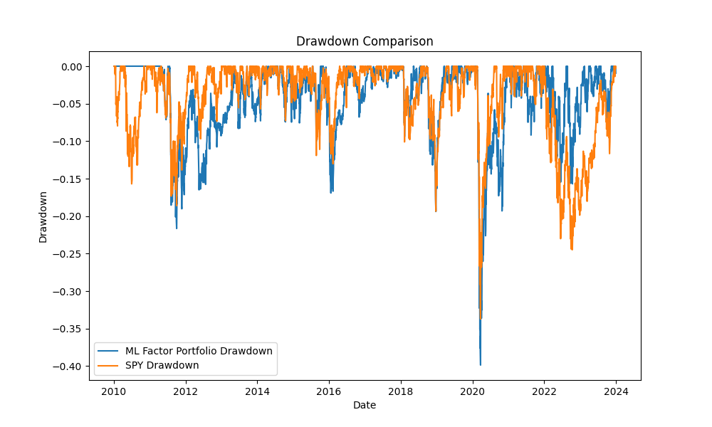

## ML Factor Portfolio Backtest

A machine learning factor-based portfolio backtesting project in Python.

## Project Overview

This project builds a machine learning portfolio strategy using ETF price data.

The strategy uses multiple quantitative factors to predict future asset returns and constructs a monthly rebalanced portfolio. The model is trained using a walk-forward process, meaning it only uses historical information available before each rebalance date.

The purpose of this project is to demonstrate a complete quantitative research workflow, including:

* Data collection
* Feature engineering
* Forward return labeling
* Machine learning model training
* Walk-forward prediction
* Portfolio construction
* Backtesting
* Performance evaluation

## Asset Universe

The strategy uses ETFs across equities, bonds, gold, real estate, emerging markets, developed markets, and sectors.

The asset universe includes:

* SPY: S&P 500 ETF
* QQQ: Nasdaq 100 ETF
* IWM: Russell 2000 ETF
* TLT: Long-Term Treasury ETF
* GLD: Gold ETF
* EFA: Developed Markets ETF
* EEM: Emerging Markets ETF
* VNQ: Real Estate ETF
* XLE: Energy Sector ETF
* XLK: Technology Sector ETF

## Features

The model uses the following quantitative factors:

* 1-month momentum
* 3-month momentum
* 6-month momentum
* 12-month momentum
* 21-day rolling volatility
* 63-day rolling volatility
* 63-day drawdown
* 50/200-day moving average spread
* 14-day RSI

## Model

The project uses a Random Forest Regressor to predict forward 21-day returns.

The target variable is the future 21-day return of each ETF.

The model is retrained during the backtest using only historical data available before each prediction date. This helps reduce look-ahead bias and creates a more realistic out-of-sample testing process.

## Backtesting Methodology

The strategy follows these steps:

1. Download historical ETF price data
2. Generate factor features for each ETF
3. Create forward return labels
4. Train the machine learning model using past data only
5. Predict next-month asset returns
6. Rank ETFs by predicted forward return
7. Select the top 3 predicted assets
8. Allocate equal weight to selected assets
9. Rebalance monthly
10. Apply transaction costs
11. Compare performance against SPY buy-and-hold

## Tools Used

* Python
* pandas
* numpy
* matplotlib
* yfinance
* scikit-learn

## Project Structure

```text
ml-factor-portfolio-backtest/
├── README.md
├── requirements.txt
├── .gitignore
├── LICENSE
├── src/
│   ├── config.py
│   ├── data_loader.py
│   ├── features.py
│   ├── labels.py
│   ├── model.py
│   ├── portfolio.py
│   ├── metrics.py
│   └── backtest.py
├── results/
│   ├── equity_curve.png
│   ├── drawdown.png
│   ├── predictions.csv
│   ├── weights.csv
│   ├── backtest_results.csv
│   └── performance_report.csv
└── data/
```

## How to Run

Install dependencies:

```bash
pip install -r requirements.txt
```

Run the backtest:

```bash
python src/backtest.py
```

## Performance Summary

| Metric       | ML Factor Portfolio | Benchmark |
| ------------ | ------------------: | --------: |
| Total Return |             257.75% |   445.52% |
| CAGR         |               9.54% |    12.90% |
| Volatility   |              18.90% |    17.33% |
| Sharpe Ratio |                0.58 |      0.79 |
| Max Drawdown |             -39.87% |   -33.72% |
| Calmar Ratio |                0.24 |      0.38 |

The ML factor portfolio generated positive long-term returns, but it underperformed the benchmark in total return, CAGR, Sharpe ratio, and maximum drawdown.

This highlights an important lesson in quantitative research: more complex models do not automatically produce better investment results. A machine learning model still needs careful feature design, validation, risk control, and robustness testing.

## Results

### Equity Curve



### Drawdown



## Output Files

The project generates the following files:

* `results/equity_curve.png`
* `results/drawdown.png`
* `results/predictions.csv`
* `results/weights.csv`
* `results/backtest_results.csv`
* `results/performance_report.csv`

## Performance Metrics

The project calculates:

* Total Return
* CAGR
* Volatility
* Sharpe Ratio
* Maximum Drawdown
* Calmar Ratio

## Key Takeaways

This project shows that machine learning can be integrated into a portfolio backtesting workflow, but model complexity does not guarantee better performance.

The strategy produced positive returns, but the benchmark performed better over the tested period. This makes the project more realistic because it demonstrates both the potential and limitations of machine learning in quantitative finance.

## Possible Improvements

Future improvements could include:

* Testing more asset classes
* Adding macroeconomic features
* Using alternative machine learning models
* Performing hyperparameter tuning
* Adding feature importance analysis
* Applying volatility targeting
* Adding stop-loss or risk control rules
* Testing different rebalance frequencies
* Using a longer historical dataset
* Adding transaction cost sensitivity analysis

## Disclaimer

This project is for educational and research purposes only. It is not financial advice.
